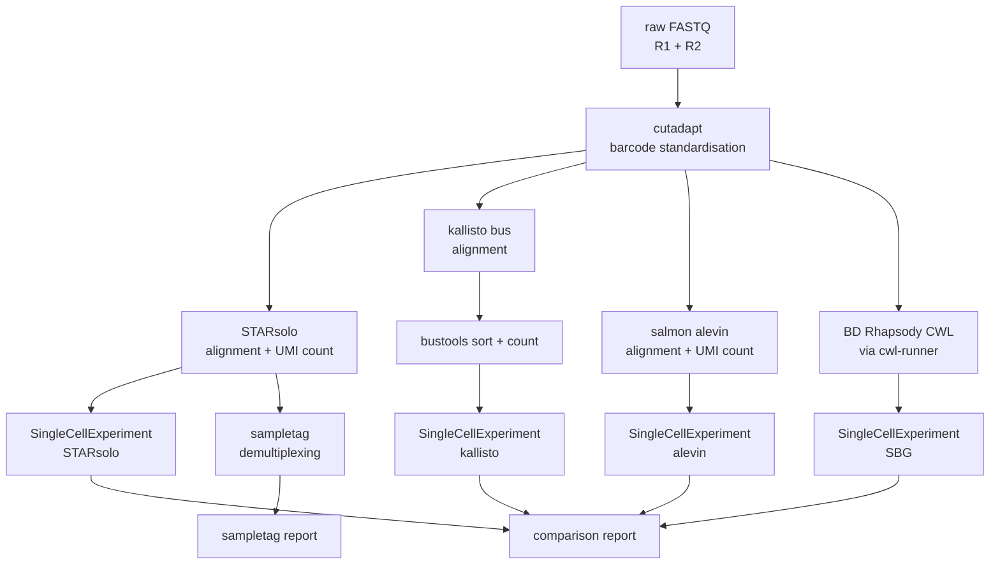

# Aim

Rhapsodist is a Snakemake workflow to process BD Rhapsody WTA (enhanced beads) single-cell RNA-seq data. It pre-processes raw FASTQ reads through barcode standardisation with cutadapt, then runs alignment and UMI counting in parallel with STARsolo, kallisto/bustools, salmon/alevin, and optionally the official BD Rhapsody CWL pipeline. Each path produces a SingleCellExperiment object. Cell filtering can use each tool's native approach or DropletUtils emptyDrops. The workflow also handles sample tag demultiplexing and renders comparison reports across methods.

## Analysis paths



## TL/DR

Simulations:

```
snakemake --use-conda --cores 10 --configfile sim_config.yaml
```

Real data:

```
snakemake --use-conda --cores 10 --configfile config.yaml
```

## Configuration

Copy `config.yaml` and fill in the fields below before running on real data.

**Resources**

- `nthreads`: number of CPU threads
- `max_mem_mb`: RAM limit in MB
- `working_dir`: absolute path where outputs will be written

**Reference files** (uncompressed unless noted)

- `gtf_origin`: `"gencode"` or `"ensembl"`
- `gtf`: path to GTF annotation file (uncompressed)
- `genome`: path to genome FASTA (uncompressed)
- `transcriptome`: path to transcriptome FASTA (can be gzipped)
- `sjdbOverhang`: read length minus 1 (e.g. 70 for 71 bp reads)

**Aligners**

- `aligner`: list of aligners to run — any combination of `starsolo`, `kallisto`, `alevin`, `sbg`

**Samples**

```yaml
samples:
  - name: my_sample
    uses:
      cb_umi_fq: /path/to/R1.fastq.gz   # barcode + UMI read
      cdna_fq: /path/to/R2.fastq.gz     # cDNA read
      whitelist: 384x3                   # 384x3 for Enhanced beads, 96x3 for v1/Enh beads
      species: human                     # human or mouse
```

**BD Rhapsody official pipeline (optional)**

Add `'sbg'` to the `aligner` list and set `sbg_cwl` to the CWL workflow file:

```yaml
aligner: ['starsolo', 'kallisto', 'alevin', 'sbg']
sbg_cwl: third_party/cwl/v2.2.1/rhapsody_pipeline_2.2.1.cwl
```

The reference archive is built automatically from the STAR index and GTF. To use a pre-built BD archive instead:

```yaml
sbg_reference_url: "http://bd-rhapsody-public.s3-website-us-east-1.amazonaws.com/..."
# or
sbg_reference_archive: /path/to/Rhapsody_reference.tar.gz
```

## Contributors

- Izaskun Mallona
- Jiayi Wang
- Giulia Moro

Tools used include STAR, subread (featureCounts), samtools, kallisto, and alevin.

## Contact

izaskun.mallona at mls.uzh.ch, Mark D. Robinson lab
https://www.mls.uzh.ch/en/research/robinson.html

## Started

30 July 2024, keeping history from https://github.com/imallona/rock_roi_method
