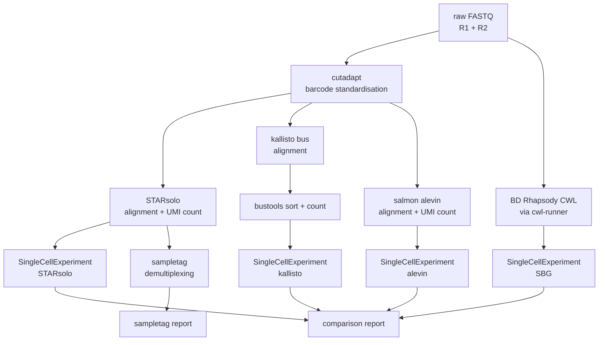

# rhapsodist

Rhapsodist is a Snakemake workflow to process BD Rhapsody WTA (enhanced beads) single-cell RNA-seq data. It pre-processes raw FASTQ reads through barcode standardisation, then runs alignment and UMI counting in parallel with STARsolo, kallisto/bustools, salmon/alevin, and/or the official BD Rhapsody CWL pipeline (locally). Each path produces a SingleCellExperiment object. Cell filtering can use each tool's native approach or DropletUtils emptyDrops. The workflow also handles sample tag demultiplexing and renders comparison reports across methods.

## Workflow layout



## Quickstart

Install the CLI (optional):

```
pip install -e .
```

Run the simulation test:

```
rhapsodist --configfile configs/sim_config.yaml --cores 10
```

Run on real data (update the YAML first to point to your R1/R2 files):

```
rhapsodist --configfile configs/config.yaml --cores 10
```

Extra snakemake arguments can be appended directly:

```
rhapsodist --configfile configs/config.yaml --cores 10 --rerun-incomplete --nolock
```

Or call snakemake directly if preferred:

```
snakemake --use-conda --cores 10 --configfile configs/config.yaml
```

## Repository layout

```
configs/          pipeline config yaml files (config.yaml, sim_config.yaml, real_config.yaml)
workflow/
  Snakefile       main snakemake workflow
  data/           reference data: barcode whitelists, sampletag sequences
  envs/           conda environment yaml files used by snakemake
  src/
    *.R           per-aligner SCE generation and report scripts
    *.Rmd         rmarkdown reports rendered by the pipeline
    *.py          python helpers and simulation scripts
    simulate.snmk snakemake rules for synthetic data generation
    reports/      standalone benchmark and overview documents
rhapsodist/       installable cli package
tests/            pytest unit tests
```

## Configuration

Copy `configs/config.yaml` and fill in the fields before running on real data.

Resources:

- `nthreads`: number of CPU threads
- `max_mem_mb`: RAM limit in MB
- `working_dir`: path where outputs will be written (relative or absolute)

Configuration:

- `gtf_origin`: `gencode` or `ensembl`
- `gtf`: path to GTF annotation file (uncompressed)
- `genome`: path to genome FASTA (uncompressed)
- `transcriptome`: path to transcriptome FASTA (can be gzipped)
- `sjdbOverhang`: read length minus 1 (e.g. 70 for 71 bp reads)

Aligners/pipelines:

- `aligner`: list of aligners to run, any combination of `starsolo`, `kallisto`, `alevin`, `sbg`

Samples:

```yaml
samples:
  - name: my_sample
    uses:
      cb_umi_fq: /path/to/R1.fastq.gz   # barcode + UMI read
      cdna_fq: /path/to/R2.fastq.gz     # cDNA read
      whitelist: 384x3                   # 384x3 for EnhV2 beads, 96x3 for Enh beads
      species: human                     # human or mouse
```

Cell filtering (`cell_filtering` key):

- `native`: each aligner uses its own method
- `emptydrops`: apply DropletUtils::emptyDrops uniformly across all aligners

BD Rhapsody official pipeline (optional): add `sbg` to the `aligner` list and set `sbg_cwl`:

```yaml
aligner: [starsolo, kallisto, alevin, sbg]
sbg_cwl: third_party/cwl/v2.2.1/rhapsody_pipeline_2.2.1.cwl
```

The reference archive is built automatically from the STAR index and GTF. to use a pre-built BD archive:

```yaml
sbg_reference_url: "http://bd-rhapsody-public.s3-website-us-east-1.amazonaws.com/..."
# or
sbg_reference_archive: /path/to/Rhapsody_reference.tar.gz
```

## Contributors

- Izaskun Mallona
- Jiayi Wang
- Giulia Moro

Tools used: STAR, samtools, kallisto, bustools, salmon/alevin, cutadapt, pigz, R/Bioconductor.

## Contact

izaskun.mallona at mls.uzh.ch, Mark D. Robinson lab
https://www.mls.uzh.ch/en/research/robinson.html

## History

started 30 July 2024, keeping history from https://github.com/imallona/rock_roi_method
