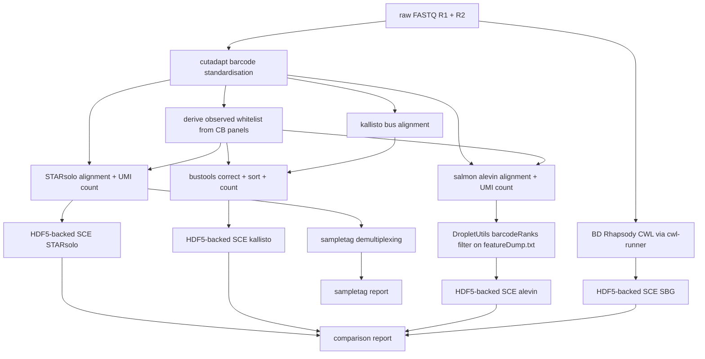

# rhapsodist

Rhapsodist is a Snakemake workflow for processing BD Rhapsody WTA single-cell RNA-seq data. It supports v1, Enhanced, and Enhanced V2 beads.

The pipeline takes raw FASTQ files, standardises barcodes, and builds a per-sample whitelist of observed cell barcodes from the BD bead barcode panels. That whitelist is passed to each aligner for barcode correction. Aligners run in parallel: STARsolo, kallisto/bustools, salmon/alevin, and optionally the official BD Rhapsody CWL pipeline. Each aligner produces an HDF5-backed SingleCellExperiment object. The pipeline also handles sample tag demultiplexing and renders comparison reports.

For alevin, DropletUtils `barcodeRanks` is applied to the DeduplicatedReads column of featureDump.txt to select cell barcodes before loading counts into R, keeping memory use low. This uses the same algorithm as the kallisto step, making cell calling consistent across aligners.

By default alevin uses graph-based EM deduplication. This distributes multi-mapping reads as fractional counts and raises per-cell UMI totals compared to unique-only aligners such as STARsolo with `soloMultiMappers: Unique`. Set `alevin_sketch: true` to use `--sketch` instead: sketch deduplication gives integer-like counts on the same scale as STARsolo Unique, making cross-aligner UMI comparison fair.

## Workflow layout



## Quickstart

Install the CLI (optional):

```
pip install -e .
```

Run the simulation test:

```
rhapsodist --configfile configs/sim_config.yaml --cores 10
```

Run on real data (update the YAML first to point to your R1/R2 files):

```
rhapsodist --configfile configs/config.yaml --cores 10
```

Extra snakemake arguments can be appended directly:

```
rhapsodist --configfile configs/config.yaml --cores 10 --rerun-incomplete --nolock
```

Or call snakemake directly:

```
snakemake --use-conda --cores 10 --configfile configs/config.yaml
```

## Repository layout

```
configs/          config yaml files (config.yaml, sim_config.yaml, real_config.yaml)
workflow/
  Snakefile       main snakemake workflow
  data/           reference data: barcode whitelists, sampletag sequences
  envs/           conda environment yaml files
  src/
    *.R           per-aligner SCE generation and report scripts
    *.Rmd         rmarkdown reports rendered by the pipeline
    *.py          python helpers and simulation scripts
    simulate.snmk snakemake rules for synthetic data generation
    reports/      standalone benchmark and overview documents
rhapsodist/       installable cli package
tests/            pytest unit tests
```

## Configuration

Copy `configs/config.yaml` and fill in the fields before running on real data.

Resources:

- `nthreads`: number of CPU threads
- `max_mem_mb`: RAM limit in MB
- `working_dir`: path where outputs will be written (relative or absolute)

Reference:

- `gtf_origin`: `gencode` or `ensembl`
- `gtf`: path to GTF annotation file (uncompressed)
- `genome`: path to genome FASTA (uncompressed)
- `transcriptome`: path to transcriptome FASTA (can be gzipped)
- `sjdbOverhang`: read length minus 1 (e.g. 70 for 71 bp reads)

Aligners:

- `aligner`: list of aligners to run, any combination of `starsolo`, `kallisto`, `alevin`, `sbg`

Samples:

```yaml
samples:
  - name: my_sample
    uses:
      cb_umi_fq: /path/to/R1.fastq.gz   # barcode + UMI read
      cdna_fq: /path/to/R2.fastq.gz     # cDNA read
      bead_version: enhanced_v2           # v1, enhanced, or enhanced_v2
      species: human                     # human or mouse
```

Cell filtering (`cell_filtering` key):

- `native`: STARsolo uses its soloCellFilter (default CellRanger2); alevin applies DropletUtils `barcodeRanks` to the DeduplicatedReads column of featureDump.txt; kallisto applies DropletUtils `barcodeRanks` to the raw cell-by-gene count matrix
- `emptydrops`: apply DropletUtils::emptyDrops across all aligners (for alevin, emptyDrops is applied after the knee filter)

Alevin UMI counting (`alevin_sketch` key):

- `alevin_sketch: false` (default): alevin uses graph-based EM deduplication. Multi-mapping reads are split as fractional counts, raising per-cell UMI totals above unique-only aligners. Not directly comparable to STARsolo with `soloMultiMappers: Unique`.
- `alevin_sketch: true`: alevin uses `--sketch` deduplication, giving integer-like counts on the same scale as STARsolo Unique. Use this when comparing UMI counts across aligners.

BD Rhapsody official pipeline (optional): add `sbg` to the `aligner` list and set `sbg_cwl`:

```yaml
aligner: [starsolo, kallisto, alevin, sbg]
sbg_cwl: third_party/cwl/v2.2.1/rhapsody_pipeline_2.2.1.cwl
```

The reference archive is built from the STAR index and GTF. To use a pre-built BD archive:

```yaml
sbg_reference_url: "http://bd-rhapsody-public.s3-website-us-east-1.amazonaws.com/..."
# or
sbg_reference_archive: /path/to/Rhapsody_reference.tar.gz
```

## Contributors

- Izaskun Mallona
- Jiayi Wang
- Giulia Moro

Tools used: STAR, samtools, kallisto, bustools, salmon/alevin, cutadapt, pigz, R/Bioconductor (SingleCellExperiment, DropletUtils, HDF5Array).

## Contact

izaskun.mallona at mls.uzh.ch, Mark D. Robinson lab
https://www.mls.uzh.ch/en/research/robinson.html

## History

started 30 July 2024, keeping history from https://github.com/imallona/rock_roi_method
