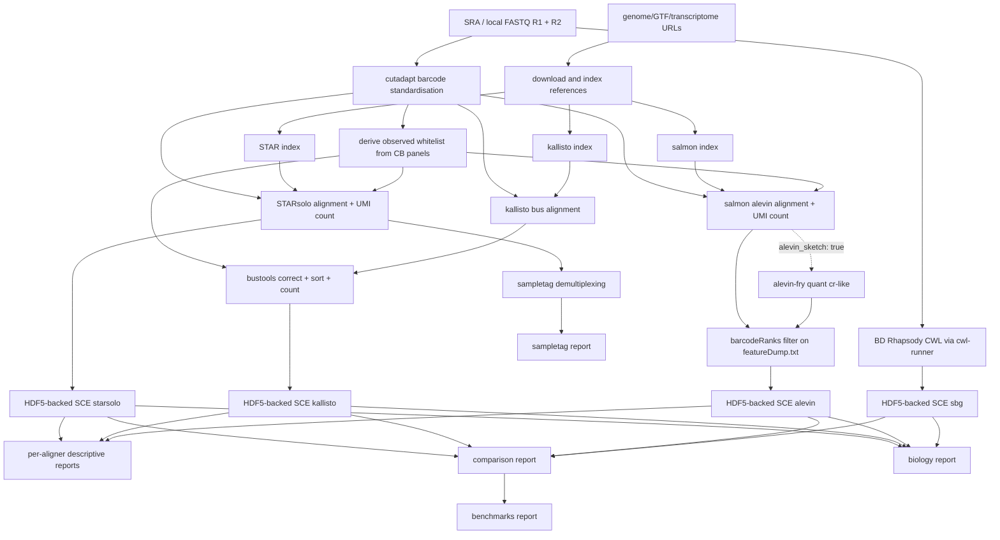

# rhapsodist

Rhapsodist is a Snakemake workflow for processing BD Rhapsody WTA single-cell RNA-seq data. It supports v1, Enhanced, and Enhanced V2 beads.

The pipeline takes raw FASTQ files (local or fetched from SRA), standardises barcodes with cutadapt, and builds a per-sample whitelist of observed cell barcodes from the BD bead barcode panels. That whitelist is passed to each aligner for barcode correction. Aligners run in parallel: STARsolo, kallisto/bustools, salmon/alevin, and optionally the official BD Rhapsody CWL pipeline. Each aligner produces an HDF5-backed SingleCellExperiment object. The pipeline also handles sample tag demultiplexing and generates four types of reports: per-aligner descriptive, cross-pipeline comparison, benchmarks, and biology.

For alevin, DropletUtils barcodeRanks is applied to the DeduplicatedReads column of featureDump.txt to select cell barcodes before loading counts into R, keeping memory use low. This uses the same algorithm as the kallisto step, making cell calling consistent across aligners.

By default alevin uses graph-based EM deduplication. This distributes multi-mapping reads as fractional counts and raises per-cell UMI totals compared to unique-only aligners such as STARsolo with soloMultiMappers: Unique. Set `alevin_sketch: true` to use `--sketch` instead: sketch deduplication gives integer-like counts on the same scale as STARsolo Unique, making cross-aligner UMI comparison fair.

## Workflow diagram



## Quickstart

Install the CLI (optional):

```
pip install -e .
```

Run the simulation test:

```
rhapsodist --configfile configs/sim_config.yaml --cores 10
```

Run on real data (update the YAML first to point to your R1/R2 files or SRA accessions):

```
rhapsodist --configfile configs/config.yaml --cores 10
```

Extra snakemake arguments can be appended directly:

```
rhapsodist --configfile configs/config.yaml --cores 10 --rerun-incomplete --nolock
```

Or call snakemake directly:

```
snakemake --use-conda --cores 10 --configfile configs/config.yaml
```

## Example configs

The repository includes three config files under `configs/`:

- `config.yaml`: base template with all available options and comments. Copy this as a starting point for new datasets.
- `sim_config.yaml`: simulated BD Rhapsody data used for CI and testing.
- `sendoel2024_config.yaml`: P60 mouse epidermis from a pooled CRISPR screen (Sendoel et al. 2024, GEO GSE235325). Multiple cell types, v1 beads, mouse GRCm39 vM36. Fetches FASTQs from SRA; includes per-cell guide assignments from the authors.

## Repository layout

```
configs/                 config yaml files (see above)
workflow/
  Snakefile              main snakemake workflow
  data/
    barcodes/            BD bead barcode whitelists (v1, enhanced, enhanced_v2)
    markers/             marker gene TSV files for biology reports
    sampletags/          sample tag sequences
  envs/                  conda environment yaml files
  src/
    *.R                  per-aligner SCE generation and report scripts
    *.py                 python helpers, simulation, barcode matching
    *.Rmd                rmarkdown reports rendered by the pipeline
    ggtheme.R            shared ggplot2 theme used in all reports
    simulate.snmk        snakemake rules for synthetic data generation
    fetch_data.snmk      snakemake rules for downloading references and SRA data
    reports/             biology and benchmark report templates
rhapsodist/              installable CLI package
tests/                   pytest unit tests
```

## Configuration

Copy `configs/config.yaml` and fill in the fields for your dataset. The main options are described below.

### Resources

```yaml
nthreads: 10
max_mem_mb: 60000
working_dir: output/my_experiment
```

### References

References can be given as local paths or as URLs. When URLs are provided, the pipeline downloads and decompresses them automatically into `reference_dir`.

Local paths:

```yaml
gtf_origin: "gencode"        # gencode or ensembl
gtf: /path/to/annotation.gtf
genome: /path/to/genome.fa
transcriptome: /path/to/transcriptome.fa.gz
sjdbOverhang: 70              # read length minus 1
```

URL-based (preferred for reproducibility):

```yaml
gtf_origin: "gencode"
reference_dir: data/reference/GRCh38_v46
genome_url: "https://ftp.ebi.ac.uk/pub/databases/gencode/Gencode_human/release_46/GRCh38.p14.genome.fa.gz"
gtf_url: "https://ftp.ebi.ac.uk/pub/databases/gencode/Gencode_human/release_46/gencode.v46.primary_assembly.annotation.gtf.gz"
transcriptome_url: "https://ftp.ebi.ac.uk/pub/databases/gencode/Gencode_human/release_46/gencode.v46.transcripts.fa.gz"
sjdbOverhang: 70
```

### Aligners

```yaml
aligner: ['starsolo', 'kallisto', 'alevin']
```

Any combination of starsolo, kallisto, alevin, sbg. When sbg is included, set `sbg_cwl` to the path of the BD Rhapsody CWL file.

### STARsolo options

```yaml
soloCellFilter: "EmptyDrops_CR"
soloMultiMappers: "Unique"
extraStarSoloArgs: ""
```

### Cell filtering

```yaml
cell_filtering: "native"
```

- `native`: STARsolo uses its soloCellFilter; alevin and kallisto apply DropletUtils barcodeRanks.
- `emptydrops`: apply DropletUtils emptyDrops across all aligners.

### Alevin UMI counting

```yaml
alevin_sketch: true
```

- `false` (default): alevin uses graph-based EM deduplication, giving fractional multi-mapper counts. Not directly comparable to STARsolo Unique.
- `true`: salmon runs in RAD mapping mode and alevin-fry quantifies with cr-like resolution, giving integer counts comparable to STARsolo Unique.

### Samples

FASTQs can be local files or fetched from SRA by accession:

```yaml
samples:
  - name: my_sample
    uses:
      cb_umi_fq: /path/to/R1.fastq.gz
      cdna_fq: /path/to/R2.fastq.gz
      bead_version: enhanced       # v1, enhanced, or enhanced_v2
      species: human               # human or mouse
```

SRA fetch:

```yaml
samples:
  - name: sample_16_wta_p60
    uses:
      sra_run: "SRR24978231"
      bead_version: v1
      species: mouse
```

### Reports

```yaml
skip_sampletags: true          # skip sampletag demultiplexing
run_biology_report: true       # generate biology report with marker expression, clustering, cross-pipeline concordance
biology_markers_file: data/markers/skin_markers.tsv   # TSV with marker and cell_type columns, relative to workflow dir
```

The biology report compares pipelines on QC, marker expression, pseudobulk correlation, barcode overlap, per-barcode UMI concordance, and cluster agreement (adjusted Rand index). It reads a markers TSV file with two columns (marker, cell_type) to know which genes to check. A `skin_markers.tsv` file is included for mouse epidermis (used by Sendoel); add your own TSV for other tissues.

When external per-cell metadata is available (e.g. CRISPR guide assignments from a separate amplicon library), the report joins it for visualization. The pipeline itself does not process or quantify guides.

### BD Rhapsody official pipeline (optional)

Add sbg to the aligner list and set sbg_cwl:

```yaml
aligner: [starsolo, kallisto, alevin, sbg]
sbg_cwl: third_party/cwl/v2.2.1/rhapsody_pipeline_2.2.1.cwl
```

The reference archive is built from the STAR index and GTF. To use a pre-built BD archive:

```yaml
sbg_reference_url: "http://bd-rhapsody-public.s3-website-us-east-1.amazonaws.com/..."
# or
sbg_reference_archive: /path/to/Rhapsody_reference.tar.gz
```

## Contributors

- Izaskun Mallona
- Jiayi Wang
- Giulia Moro

Tools used: STAR, samtools, kallisto, bustools, salmon/alevin, cutadapt, pigz, R/Bioconductor (SingleCellExperiment, DropletUtils, HDF5Array).

## Contact

izaskun.mallona at mls.uzh.ch, Mark D. Robinson lab
https://www.mls.uzh.ch/en/research/robinson.html

## History

started 30 July 2024, keeping history from https://github.com/imallona/rock_roi_method
